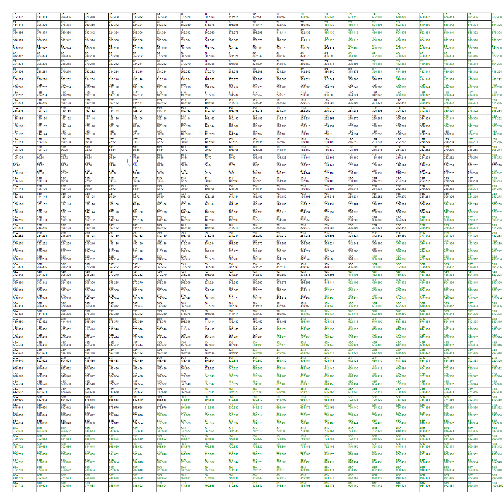

Question copied from: https://fivethirtyeight.com/features/how-fast-can-you-deliver-pbjs-how-many-meerkats-can-survive/

# Question
## Riddler Express

From Steven Pratt, welcome to Riddler City:

You are a delivery person for the finest peanut butter and jelly sandwich restaurant in Riddler City. City streets are laid out in a grid, and your restaurant is on the corner of 20th Street and Avenue F. The city has 61 east-west streets, numbered 1st to 61st, and 21 north-south avenues, named A to U.

While traveling on a given street or avenue, you can drive at 20 mph, and the blocks are all 0.1 miles long. The exception is Avenue U, also known as the Ultra-Speed Trafficway, upon which you can drive at 200 mph. (You don’t need to worry about slowing down for traffic or turns.)

What are the parts of the map for which it’s helpful to use the Ultra for your deliveries, assuming you always start at 20th and F?

# My Answer
The corners that benefit from using the ultra speed avenue are:

All blocks north of and to the east of (including): 1M,4N,6O,8P,11Q,13R,15S,17T,19U.

All blocks south of and to the east of (including): 21U,23T,25S,27R,30Q,32P,34O,36N,39M,41L,43K,45J,47I,50H,52G,54F,54E,54D,54C,54B,54A.

The complete list of intersections that benefit from using the ultra speed avenue are (including):

1M,1N,1O,1P,1Q,1R,1S,1T,1U,2N,2O,2P,2Q,2R,2S,2T,2U,3N,3O,3P,3Q,3R,3S,3T,3U,4N,4O,4P,4Q,4R,4S,4T,4U,5O,5P,5Q,5R,5S,5T,5U,6O,6P,6Q,6R,6S,6T,6U,7P,7Q,7R,7S,7T,7U,8P,8Q,8R,8S,8T,8U,9Q,9R,9S,9T,9U,10Q,10R,10S,10T,10U,11Q,11R,11S,11T,11U,12R,12S,12T,12U,13R,13S,13T,13U,14S,14T,14U,15S,15T,15U,16T,16U,17T,17U,18U,19U,21U,22U,23T,23U,24T,24U,25S,25T,25U,26S,26T,26U,27R,27S,27T,27U,28R,28S,28T,28U,29R,29S,29T,29U,30Q,30R,30S,30T,30U,31Q,31R,31S,31T,31U,32P,32Q,32R,32S,32T,32U,33P,33Q,33R,33S,33T,33U,34O,34P,34Q,34R,34S,34T,34U,35O,35P,35Q,35R,35S,35T,35U,36N,36O,36P,36Q,36R,36S,36T,36U,37N,37O,37P,37Q,37R,37S,37T,37U,38N,38O,38P,38Q,38R,38S,38T,38U,39M,39N,39O,39P,39Q,39R,39S,39T,39U,40M,40N,40O,40P,40Q,40R,40S,40T,40U,41L,41M,41N,41O,41P,41Q,41R,41S,41T,41U,42L,42M,42N,42O,42P,42Q,42R,42S,42T,42U,43K,43L,43M,43N,43O,43P,43Q,43R,43S,43T,43U,44K,44L,44M,44N,44O,44P,44Q,44R,44S,44T,44U,45J,45K,45L,45M,45N,45O,45P,45Q,45R,45S,45T,45U,46J,46K,46L,46M,46N,46O,46P,46Q,46R,46S,46T,46U,47I,47J,47K,47L,47M,47N,47O,47P,47Q,47R,47S,47T,47U,48I,48J,48K,48L,48M,48N,48O,48P,48Q,48R,48S,48T,48U,49I,49J,49K,49L,49M,49N,49O,49P,49Q,49R,49S,49T,49U,50H,50I,50J,50K,50L,50M,50N,50O,50P,50Q,50R,50S,50T,50U,51H,51I,51J,51K,51L,51M,51N,51O,51P,51Q,51R,51S,51T,51U,52G,52H,52I,52J,52K,52L,52M,52N,52O,52P,52Q,52R,52S,52T,52U,53G,53H,53I,53J,53K,53L,53M,53N,53O,53P,53Q,53R,53S,53T,53U,54A,54B,54C,54D,54E,54F,54G,54H,54I,54J,54K,54L,54M,54N,54O,54P,54Q,54R,54S,54T,54U,55A,55B,55C,55D,55E,55F,55G,55H,55I,55J,55K,55L,55M,55N,55O,55P,55Q,55R,55S,55T,55U,56A,56B,56C,56D,56E,56F,56G,56H,56I,56J,56K,56L,56M,56N,56O,56P,56Q,56R,56S,56T,56U,57A,57B,57C,57D,57E,57F,57G,57H,57I,57J,57K,57L,57M,57N,57O,57P,57Q,57R,57S,57T,57U,58A,58B,58C,58D,58E,58F,58G,58H,58I,58J,58K,58L,58M,58N,58O,58P,58Q,58R,58S,58T,58U,59A,59B,59C,59D,59E,59F,59G,59H,59I,59J,59K,59L,59M,59N,59O,59P,59Q,59R,59S,59T,59U,60A,60B,60C,60D,60E,60F,60G,60H,60I,60J,60K,60L,60M,60N,60O,60P,60Q,60R,60S,60T,60U,61A,61B,61C,61D,61E,61F,61G,61H,61I,61J,61K,61L,61M,61N,61O,61P,61Q,61R,61S,61T,61U.

Description:

I solved this by writing a program that uses Dijkstra's algorithm for shortest path in a weighted graph. In short these are the steps:

Calculate the cost in seconds of travelling 1 block:

0.1 miles at 20mph takes 18 seconds.

0.1 miles at 200mph takes 2 seconds.

Create a graph data structure where vertices are represented by the road intersections and the edges have a cost according to the above times in seconds. 

For all vertices in the graph apply Dijkstra's algorithm for shortest path in a weighted graph. Keep track of where a path has travelled at least 1 block on the ultra speed avenue. Of the 1281 intersections 527 benefit from using the ultra speed avenue.

A graphic representation of the graph and cost as well as source code (~250 lines C#) will be published on github after the time limit for solutions has ran out. 

## Image of Riddle City roads

Blue circled intersection (20F) is the starting corner. 

Next to each intersection is the name of the intersection. E.g 20F. 

Under the name is cost (in seconds) of direct travel and cost of using the ultra speed road. E.g for intersection 1M the cost of direct travel is 468 and the cost of travelling on the ultra speed road is 452. 

